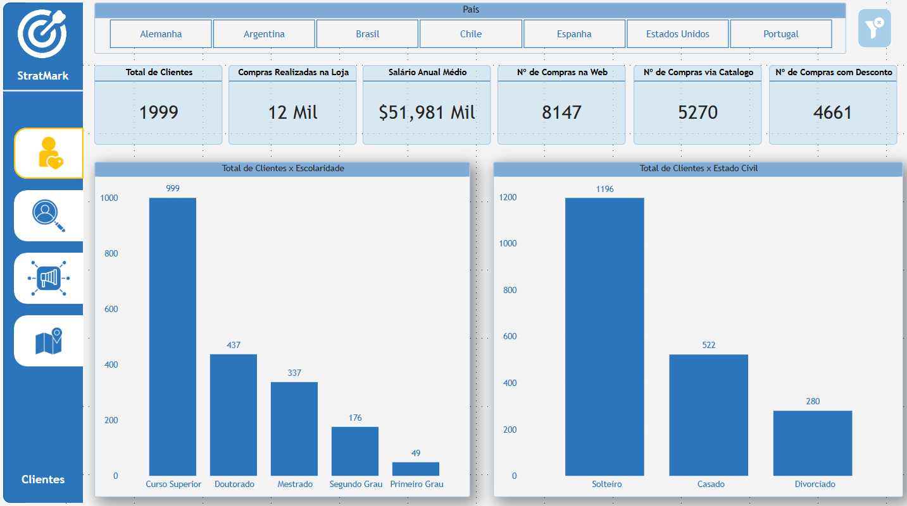
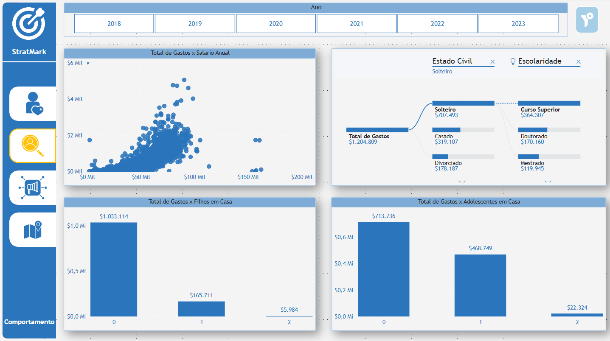
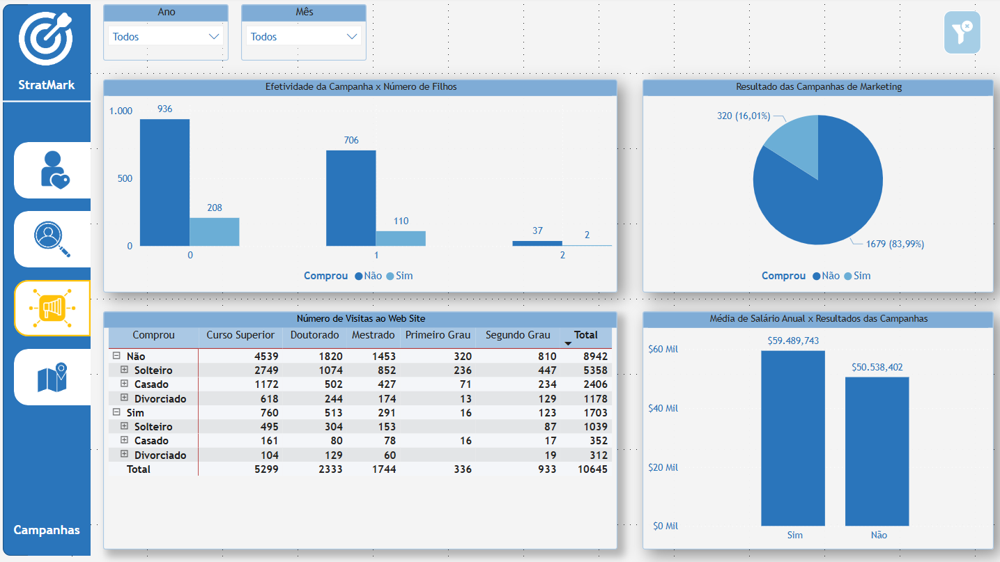
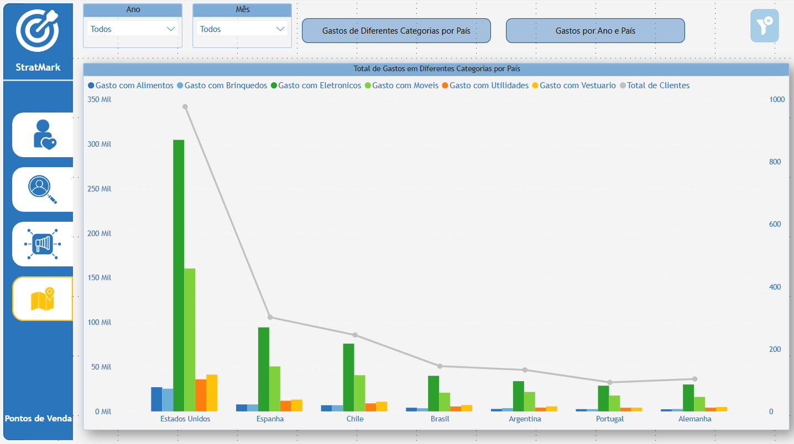
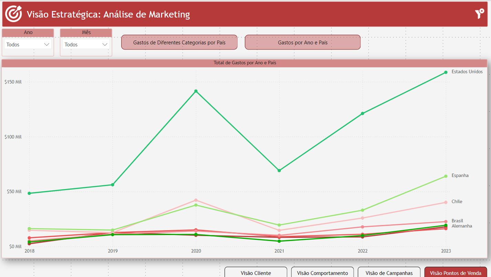

# Dashboard de Métricas de Marketing - Power BI

Este repositório contém um dashboard analítico desenvolvido em Power BI como parte do curso da plataforma **Data Science Academy**. O objetivo principal é apresentar métricas relevantes para análise de desempenho em marketing, proporcionando insights que auxiliam na tomada de decisões estratégicas.

---

# 📊 Sobre o Projeto

O Dashboard de Métricas de Marketing foi criado para:

- Monitorar o desempenho de campanhas de marketing.
- Identificar tendências e oportunidades de melhoria.
- Facilitar o acompanhamento de indicadores de sucesso.
- Fornecer uma visão clara e visual sobre as métricas mais importantes para as operações de marketing.

---

# 🛠️ Tecnologias Utilizadas

- **Power BI** - Para criação e visualização de dashboards interativos.
- **DAX (Data Analysis Expressions)** - Para cálculos e criação de medidas personalizadas.
- **Excel/CSV** - Como fonte de dados para alimentar o dashboard.

---

# 📈 Principais Métricas e KPIs

O Dashboard destaca as seguintes métricas principais:

1. **Taxa de Conversão**: A proporção de visitantes do site que realizam uma ação desejada, como comprar um produto ou preencher um formulário de contato.
2. **Taxa de Retenção do Cliente**: A porcentagem de clientes que retornam para realizar novas compras.
3. **Custo por Aquisição de Cliente (CAC)**: O custo total para adquirir um novo cliente, incluindo despesas de publicidade e marketing.
4. **Retorno sobre Investimento (ROI)**: A relação entre o lucro ou prejuízo e o investimento feito em campanhas de marketing.
5. **Conscientização da Marca**: O nível de familiaridade e reconhecimento da marca entre o público-alvo.
6. **Engajamento**: A interação dos usuários com o conteúdo, campanhas e canais de marketing.
7. **Net Promoter Score (NPS)**: Uma medida da lealdade dos clientes, baseada na disposição deles em recomendar a empresa ou produto.
8. **Tráfego do Website**: O número total de visitas ao site.

---

# 📂 Estrutura do Repositório

```bash
|-- dashboard/
|   |-- painel_marketing.pbix
|-- data/
|   |-- dados_marketing.csv
|-- public/
|   |-- img/
|       |-- pre-visualizacao1.png
|       |-- pre-visualizacao2.png
|-- readme.md
```

---

# 📷 Pré-visualização

### Visão Cliente:



### Visão Comportamento:



### Visão de Campanhas:



### Visão Pontos de Venda:





---

# 🚀 Como Usar

1. Clone o repositório:

```bash
git clone https://github.com/DiogoMEng/projetos-powerbi.git
```

2. Acesse o diretório do projeto:

```bash
cd analiseCampanhasMarketing
```

3. Abra o arquivo .pbix no Power BI Desktop:
   - Baixe o Power BI Desktop <a href="https://www.microsoft.com/pt-br/download/details.aspx?id=58494">aqui</a>
   - Abra o arquivo dashboard-analise-vendas-custos para visualizar e explorar o dashboard.

---

# 📋 Requisitos

- Power BI Desktop instalado.
- Conexão com as fontes de dados (ou ajuste para usar os arquivos CSV incluídos).

---

# 🤝 Contribuições

Contribuições são sempre bem-vindas! Se você tiver sugestões de melhorias ou quiser reportar algum problema, sinta-se à vontade para abrir uma **issue** ou enviar um **pull request**.

---

# 👤 Autor

**Diogo Dias Mello**  
Desenvolvedor Backend | Entusiasta de Análise de Dados  
[LinkedIn](www.linkedin.com/in/diogo-meng) | [Portfólio](https://diogomello-dev.netlify.app)

---

# 📝 Notas Finais

Este Gerenciador de Despesas foi desenvolvido para fins de aprendizado e demonstração. Fique à vontade para utilizá-lo como base para seus próprios projetos de controle financeiro e análise de dados.
