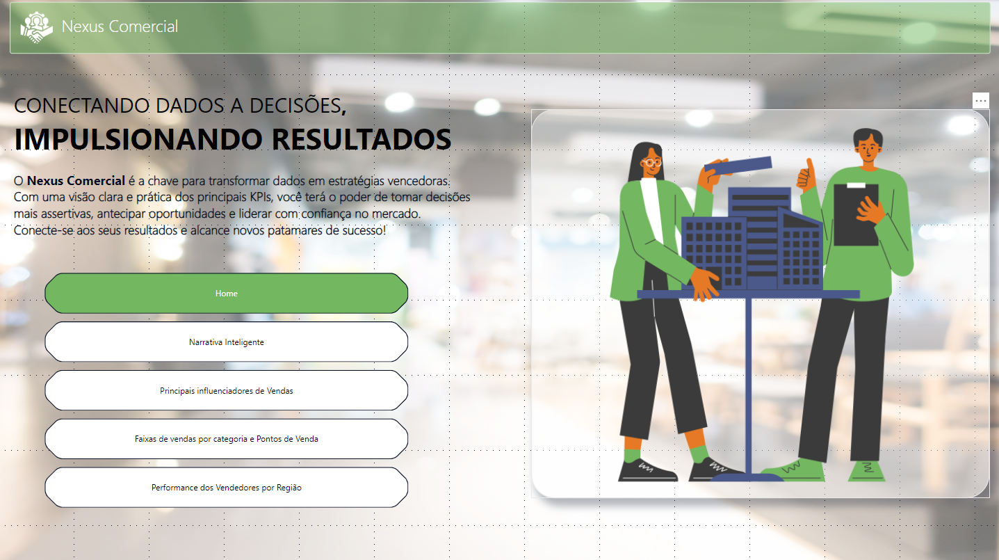
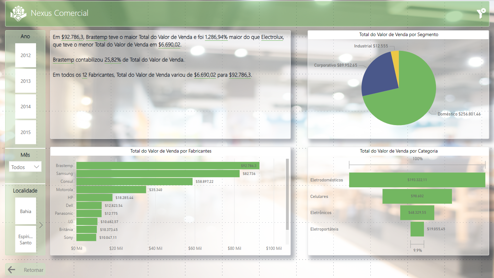
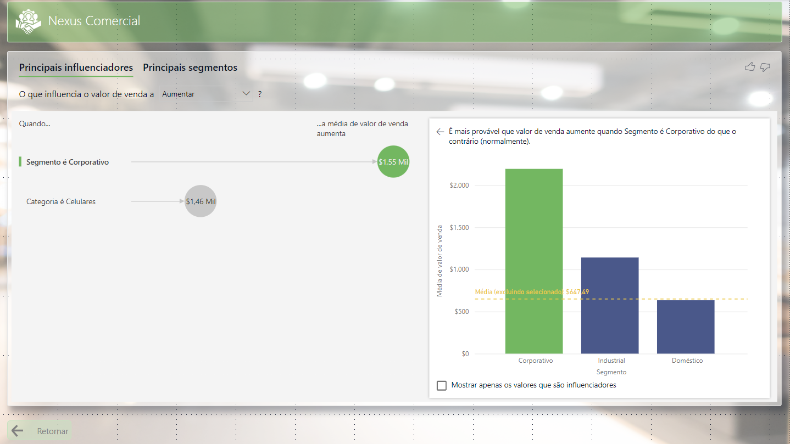
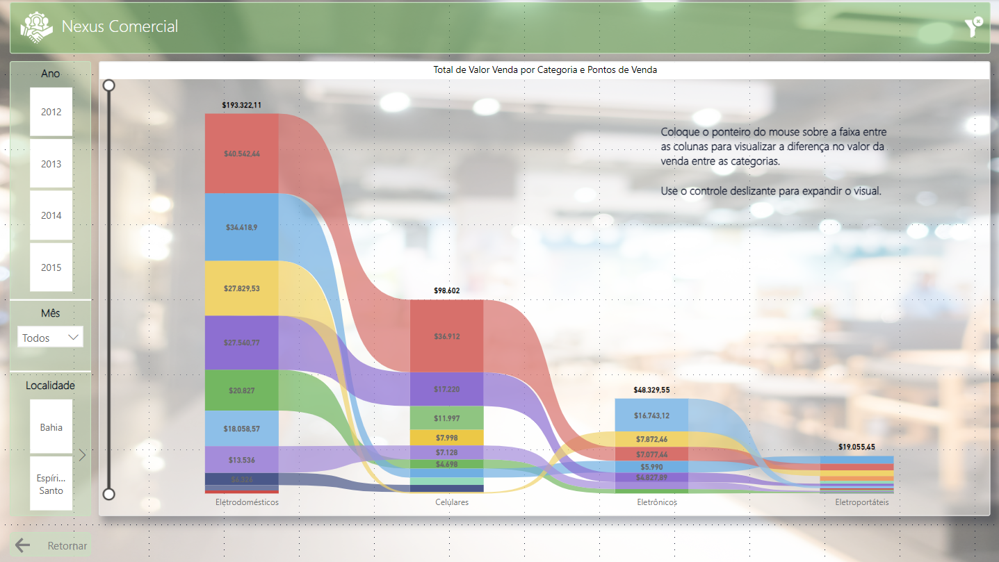
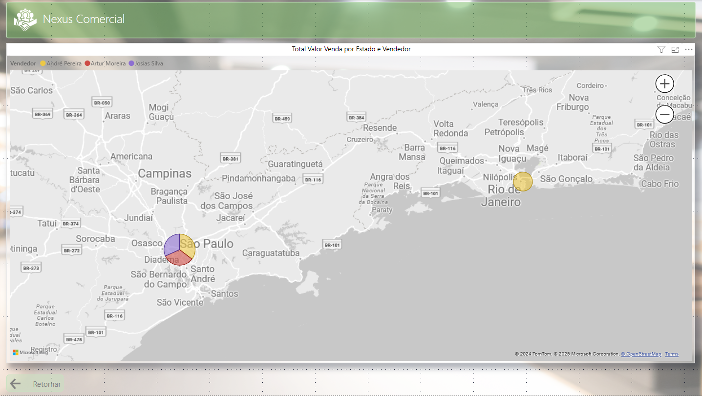

# Dashboard de Análise de Dados Comerciais - Power BI

Este repositório contém um dashboard analítico desenvolvido em Power BI como parte do curso da plataforma **Data Science Academy**. O objetivo principal é realizar uma análise detalhada dos dados do setor comercial, proporcionando insights para melhorar o desempenho de vendas e a eficiência operacional.

---

# 📊 Sobre o Projeto

O Dashboard de Análise de Dados Comerciais foi criado para:

- Monitorar o desempenho das atividades comerciais.
- Identificar tendências e oportunidades de vendas.
- Fornecer uma visão detalhada sobre indicadores-chave de desempenho (KPIs) do setor.
- Auxiliar a equipe comercial na tomada de decisões estratégicas.

---

# 🛠️ Tecnologias Utilizadas

- **Power BI** - Para criação e visualização de dashboards interativos.
- **DAX (Data Analysis Expressions)** - Para cálculos e criação de medidas personalizadas.
- **Excel/CSV** - Como fonte de dados para alimentar o dashboard.

---

# 📈 Principais Métricas e KPIs

O dashboard destaca as seguintes métricas principais:

1. **Volume de Vendas**: Quantidade total de produtos ou serviços vendidos.
2. **Ticket Médio**: Valor médio das vendas por transação.
3. **Taxa de Conversão**: Proporção de visitantes do site ou contatos que se tornam clientes.
4. **Ciclo de Vendas**: Tempo médio necessário para fechar uma venda, desde o primeiro contato com o cliente até o fechamento.
5. **Retenção de Clientes**: Taxa de clientes que realizam compras repetidas.
6. **Lucratividade**: Receita líquida obtida após descontar os custos.
7. **Produtividade da Equipe de Vendas**: Quantidade de vendas realizadas por vendedor em um período.
8. **Satisfação do Cliente**: Indicador da satisfação dos clientes com a empresa e os serviços/produtos oferecidos.

---

# 📂 Estrutura do Repositório

```bash
|-- dashboard/
|   |-- dashboard_comercial.pbix
|-- data/
|   |-- dados_comerciais.csv
|-- public/
|   |-- img/
|-- readme.md
```

---

# 📷 Pré-visualização

### Visão da Home:



### Visão de Venda Geral:



### Visão Principais Influenciadores:



### Visão de Vendas por Categoria e Pontos de Venda:



### Visão Performance dos Vendedores por Região:



---

# 🚀 Como Usar

1. Clone o repositório:

```bash
git clone https://github.com/DiogoMEng/projetos-powerbi.git
```

2. Acesse o diretório do projeto:

```bash
cd ./projetos-powerbi/analiseComercial
```

3. Abra o arquivo .pbix no Power BI Desktop:
   - Baixe o Power BI Desktop <a href="https://www.microsoft.com/pt-br/download/details.aspx?id=58494">aqui</a>
   - Abra o arquivo dashboard-analise-vendas-custos para visualizar e explorar o dashboard.

---

# 📋 Requisitos

- Power BI Desktop instalado.
- Conexão com as fontes de dados (ou ajuste para usar os arquivos CSV incluídos).

---

# 🤝 Contribuições

Contribuições são sempre bem-vindas! Se você tiver sugestões de melhorias ou quiser reportar algum problema, sinta-se à vontade para abrir uma **issue** ou enviar um **pull request**.

---

# 👤 Autor

**Diogo Dias Mello**  
Desenvolvedor Backend | Entusiasta de Análise de Dados  
[LinkedIn](www.linkedin.com/in/diogo-meng) | [Portfólio](https://diogomello-dev.netlify.app)

---

# 📝 Notas Finais

Este Gerenciador de Despesas foi desenvolvido para fins de aprendizado e demonstração. Fique à vontade para utilizá-lo como base para seus próprios projetos de controle financeiro e análise de dados.
