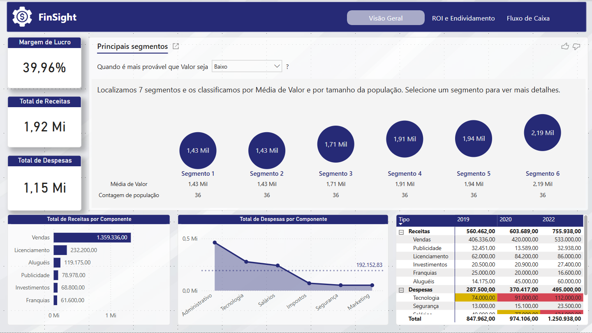
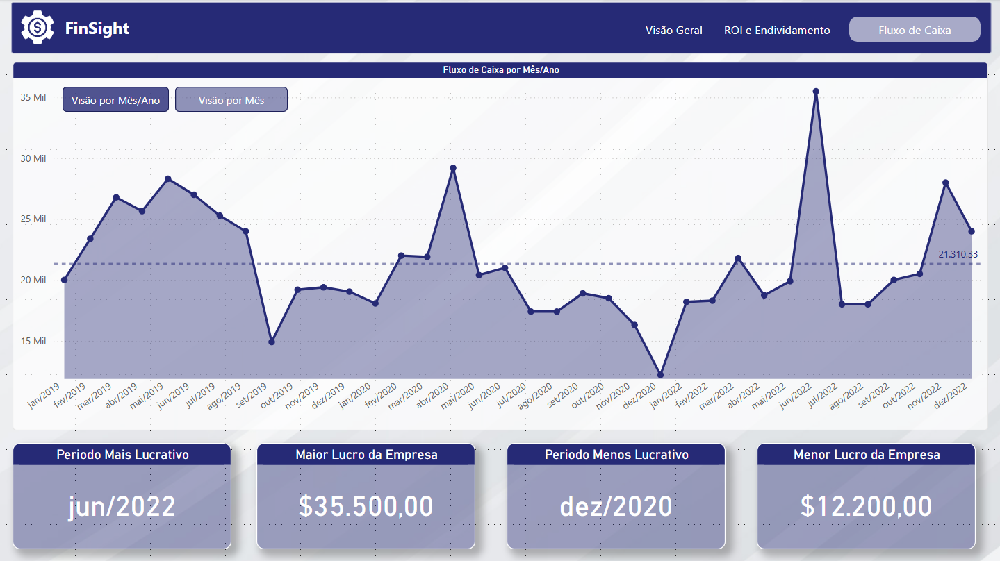
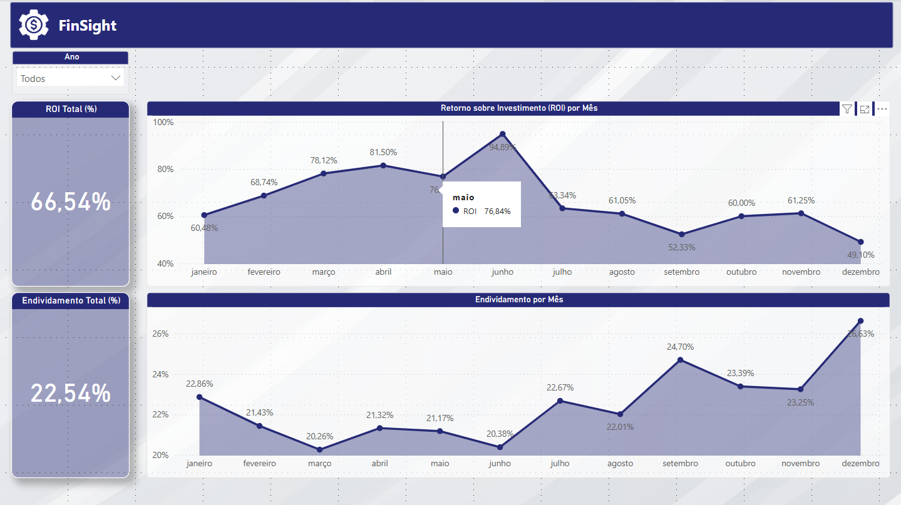

# Dashboard de Análise Financeira - Power BI

Este repositório contém um dashboard analítico desenvolvido em Power BI como parte do curso da plataforma **Data Science Academy**. O objetivo é oferecer uma visão abrangente sobre os principais indicadores financeiros, auxiliando na tomada de decisões estratégicas e na gestão financeira da empresa.

---

# 📊 Sobre o Projeto

O Dashboard de Análise Financeira foi criado para:

- Monitorar os principais indicadores financeiros da empresa.
- Identificar oportunidades para melhorar a gestão de recursos.
- Fornecer insights visuais e detalhados sobre o desempenho financeiro.
- Apoiar decisões estratégicas com base em dados confiáveis e atualizados.

---

# 🛠️ Tecnologias Utilizadas

- **Power BI** - Para criação de dashboards interativos.
- **DAX (Data Analysis Expressions)** - Para cálculos e criação de medidas personalizadas.
- **Excel/CSV** - Como fonte de dados para alimentar o dashboard.

---

# 📈 Principais Métricas e KPIs

O dashboard inclui os seguintes indicadores financeiros:

1. **Fluxo de Caixa**: Medida do dinheiro que entra e sai da empresa em um período. Um fluxo de caixa positivo indica que a empresa está gerando receita suficiente para cobrir suas despesas.
2. **Margem de Lucro**: Percentual de lucro obtido em cada venda, calculado dividindo o lucro líquido pela receita total.
3. **Retorno sobre o Investimento (ROI)**: Indicador do retorno obtido em relação ao investimento inicial.
4. **Endividamento**: Razão entre a dívida total da empresa e seu patrimônio líquido.
5. **Faturamento**: Receita total gerada pela empresa em um determinado período.
6. **Prazo Médio de Pagamento (PMP)**: Tempo médio para pagar fornecedores, calculado dividindo o valor total das compras pelo valor pago no período.

---

# 📂 Estrutura do Repositório

```bash
|-- dashboard/
|   |-- Dax/
|   |   |-- medidas.dax
|   |-- painel_financeiro.pbix
|-- data/
|   |-- dados_financeiros.csv
|-- public/
|   |-- img/
|-- readme.md
```

---

# 📷 Pré-visualização

### Visão Financeira Geral:



### Visão Fluxo de Caixa:



### Visão ROI e Endividamento:



---

# 🚀 Como Usar

1. Clone o repositório:

```bash
git clone https://github.com/DiogoMEng/projetos-powerbi.git
```

2. Acesse o diretório do projeto:

```bash
cd projetos-powerbi/analiseFinanceira
```

3. Abra o arquivo .pbix no Power BI Desktop:
   - Baixe o Power BI Desktop <a href="https://www.microsoft.com/pt-br/download/details.aspx?id=58494">aqui</a>
   - Abra o arquivo dashboard-analise-vendas-custos para visualizar e explorar o dashboard.

---

# 📋 Requisitos

- Power BI Desktop instalado.
- Conexão com as fontes de dados (ou ajuste para usar os arquivos CSV incluídos).

---

# 🤝 Contribuições

Contribuições são sempre bem-vindas! Se você tiver sugestões de melhorias ou quiser reportar algum problema, sinta-se à vontade para abrir uma **issue** ou enviar um **pull request**.

---

# 👤 Autor

**Diogo Dias Mello**  
Desenvolvedor Backend | Entusiasta de Análise de Dados  
[LinkedIn](www.linkedin.com/in/diogo-meng) | [Portfólio](https://diogomello-dev.netlify.app)

---

# 📝 Notas Finais

Este Gerenciador de Despesas foi desenvolvido para fins de aprendizado e demonstração. Fique à vontade para utilizá-lo como base para seus próprios projetos de controle financeiro e análise de dados.
