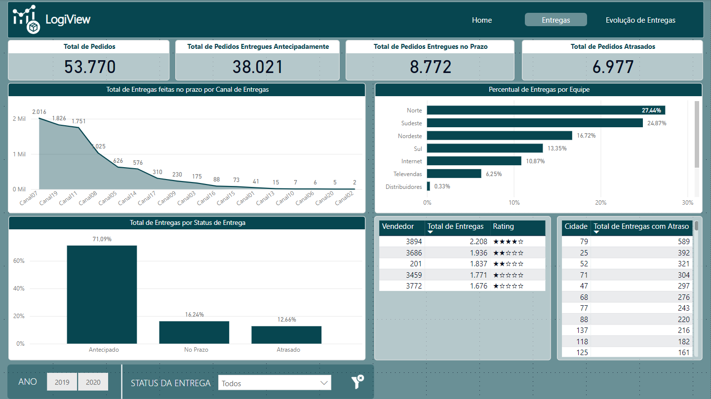
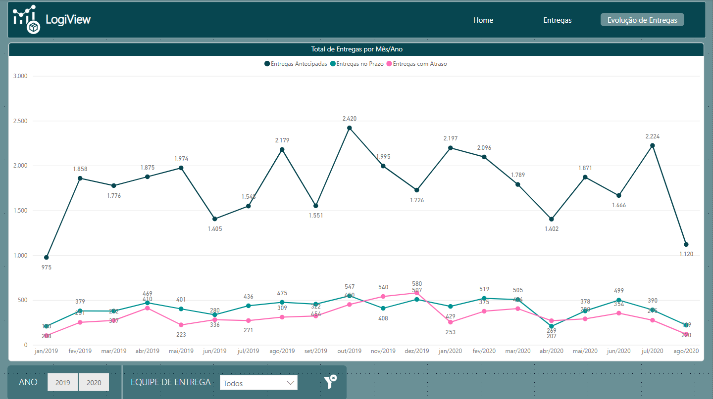

# Dashboard de Análise Logística - Power BI

Este repositório contém um dashboard analítico desenvolvido em Power BI como parte do curso da plataforma **Data Science Academy**. O objetivo principal é analisar dados do setor logístico, oferecendo insights que auxiliam na otimização de processos e na melhoria do desempenho operacional.

---

# 📊 Sobre o Projeto

O Dashboard de Análise Logística foi criado para:

- Monitorar o desempenho das operações logísticas.
- Identificar gargalos e oportunidades de melhoria nos processos.
- Fornecer uma visão clara e visual sobre os principais indicadores do setor.
- Apoiar a tomada de decisões estratégicas para melhorar a eficiência logística.

---

# 🛠️ Tecnologias Utilizadas

- **Power BI** - Para criação e visualização de dashboards interativos.
- **DAX (Data Analysis Expressions)** - Para cálculos e criação de medidas personalizadas.
- **Excel/CSV** - Como fonte de dados para alimentar o dashboard.

---

# 📈 Principais Métricas e KPIs

O dashboard destaca as seguintes métricas principais:

1. **Tempo de Ciclo**: O tempo necessário para atender um pedido, desde o momento em que é feito até o momento em que é entregue ao cliente.
2. **Taxa de Entrega no Prazo**: A porcentagem de pedidos entregues dentro do prazo acordado.

---

# 📂 Estrutura do Repositório

```bash
|-- dashboard/
|   |-- Dax/
|   |   |-- medidas.dax
|   |-- dashboard_logistica.pbix
|-- data/
|   |-- datasetLogistica.csv
|-- public/
|   |-- img/
|-- readme.md
```

---

# 📷 Pré-visualização

### Home:


### Visão Entregas:



### Visão Evolução de Entregas:



---

# 🚀 Como Usar

1. Clone o repositório:

```bash
git clone https://github.com/DiogoMEng/projetos-powerbi.git
```

2. Acesse o diretório do projeto:

```bash
cd ./projetos-powerbi/analiseLogistica
```

3. Abra o arquivo .pbix no Power BI Desktop:
   - Baixe o Power BI Desktop <a href="https://www.microsoft.com/pt-br/download/details.aspx?id=58494">aqui</a>
   - Abra o arquivo dashboard-analise-vendas-custos para visualizar e explorar o dashboard.

---

# 📋 Requisitos

- Power BI Desktop instalado.
- Conexão com as fontes de dados (ou ajuste para usar os arquivos CSV incluídos).

---

# 🤝 Contribuições

Contribuições são sempre bem-vindas! Se você tiver sugestões de melhorias ou quiser reportar algum problema, sinta-se à vontade para abrir uma **issue** ou enviar um **pull request**.

---

# 👤 Autor

**Diogo Dias Mello**  
Desenvolvedor Backend | Entusiasta de Análise de Dados  
[LinkedIn](www.linkedin.com/in/diogo-meng) | [Portfólio](https://diogomello-dev.netlify.app)

---

# 📝 Notas Finais

Este Gerenciador de Despesas foi desenvolvido para fins de aprendizado e demonstração. Fique à vontade para utilizá-lo como base para seus próprios projetos de controle financeiro e análise de dados.
