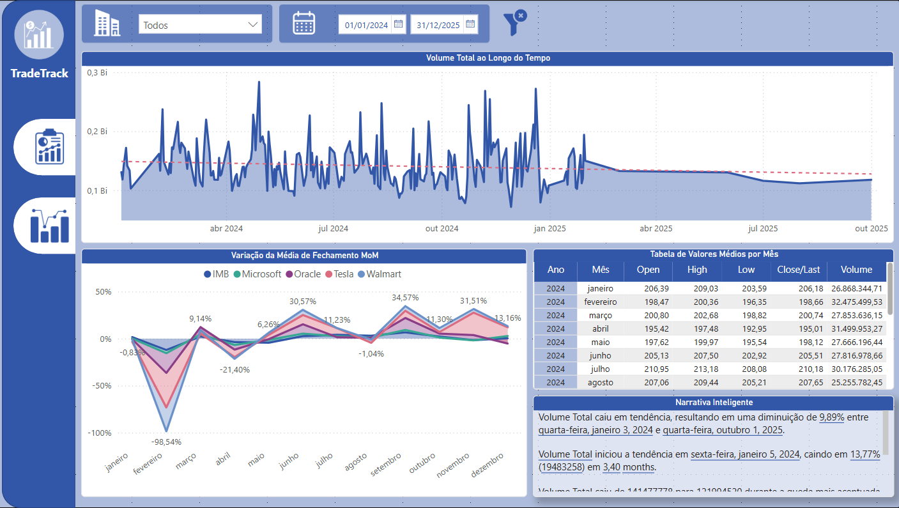
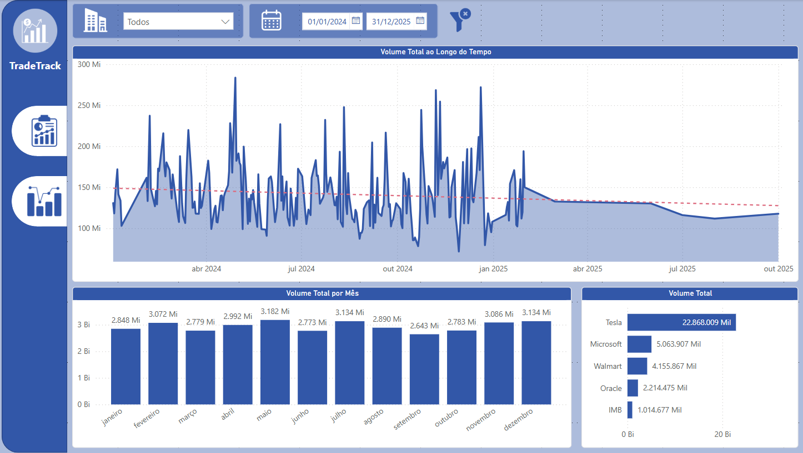

# 📊 TradeTrack - Dashboard de Análise do Mercado de Ações

O **TradeTrack** é um painel interativo desenvolvido no **Power BI** para análise de dados do mercado de ações de empresas como **IBM, Microsoft, Oracle, Tesla e Walmart**. O objetivo é fornecer insights valiosos sobre o comportamento dos preços e volumes das ações ao longo do tempo, auxiliando na tomada de decisões estratégicas para investimentos.

---

## 📊 Sobre o Projeto

O **TradeTrack** permite:

- Acompanhar o volume total de ações negociadas ao longo do tempo.
- Analisar a variação percentual média do preço de fechamento mês a mês (_MoM - Month over Month_).
- Comparar os valores médios de **abertura (Open), máxima (High), mínima (Low), fechamento (Close/Last)** e **volume de negociações** por mês.
- Fornecer uma visão consolidada para análise de tendências de mercado.

---

## 🛠️ Tecnologias Utilizadas

- **Power BI** - Para visualização interativa dos dados.
- **DAX (Data Analysis Expressions)** - Para cálculos e medidas personalizadas.
- **Excel/CSV** - Como fonte de dados do mercado de ações.

---

## 📈 Principais Métricas e KPIs

O painel **TradeTrack** apresenta as seguintes métricas e indicadores:

1. **Volume Total ao Longo do Tempo**: Representa a quantidade total de ações negociadas em um determinado período, permitindo identificar picos de negociação.
2. **Variação de Média de Fechamento MoM (%)**: Mede a variação percentual do preço médio de fechamento mês a mês, indicando tendências de valorização ou desvalorização.
3. **Tabela com Médias Mensais**: Exibe os valores médios mensais das seguintes variáveis:
   - **Open**: Preço médio de abertura.
   - **High**: Preço médio da máxima atingida.
   - **Low**: Preço médio da mínima atingida.
   - **Close/Last**: Preço médio de fechamento.
   - **Volume**: Média mensal do volume negociado.

---

# 📂 Estrutura do Repositório

```bash
|-- dashboard/
|   |-- dashboard_mercado_acoes.pbix
|-- data/
|   |-- DataMock.csv
|-- public/
|   |-- img/
|-- readme.md
```

---

# 📷 Pré-visualização

### Visão Geral:



### Visão Volume de Ações:



---

# 🚀 Como Usar

1. Clone o repositório:

```bash
git clone https://github.com/DiogoMEng/projetos-powerbi.git
```

2. Acesse o diretório do projeto:

```bash
cd ./projetos-powerbi/analiseMercadoAcoes
```

3. Abra o arquivo .pbix no Power BI Desktop:
   - Baixe o Power BI Desktop <a href="https://www.microsoft.com/pt-br/download/details.aspx?id=58494">aqui</a>
   - Abra o arquivo dashboard-analise-vendas-custos para visualizar e explorar o dashboard.

---

# 📋 Requisitos

- Power BI Desktop instalado.
- Conexão com as fontes de dados (ou ajuste para usar os arquivos CSV incluídos).

---

# 🤝 Contribuições

Contribuições são sempre bem-vindas! Se você tiver sugestões de melhorias ou quiser reportar algum problema, sinta-se à vontade para abrir uma **issue** ou enviar um **pull request**.

---

# 👤 Autor

**Diogo Dias Mello**  
Desenvolvedor Backend | Entusiasta de Análise de Dados  
[LinkedIn](www.linkedin.com/in/diogo-meng) | [Portfólio](https://diogomello-dev.netlify.app)

---

# 📝 Notas Finais

Este Gerenciador de Despesas foi desenvolvido para fins de aprendizado e demonstração. Fique à vontade para utilizá-lo como base para seus próprios projetos de controle financeiro e análise de dados.
