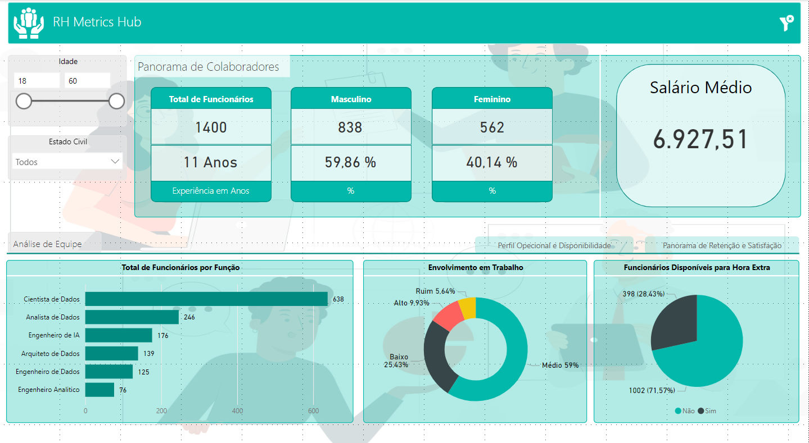
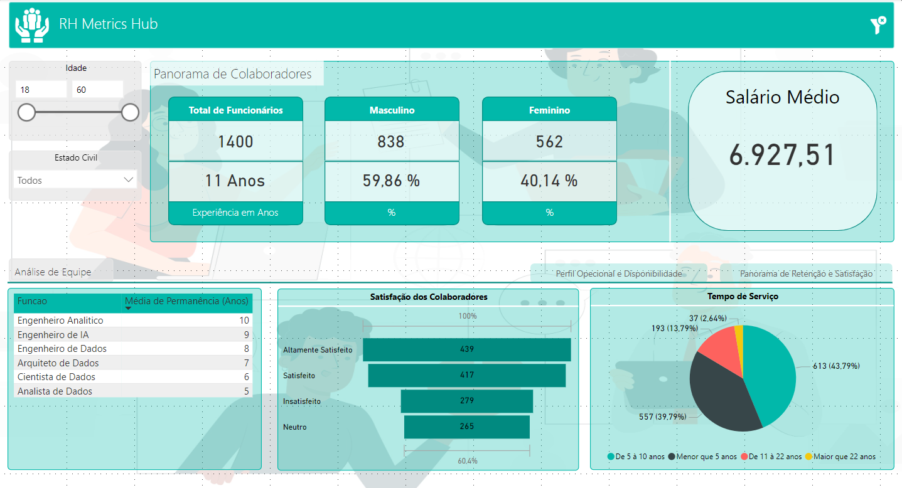

# Dashboard de Análise de Recursos Humanos - Power BI

Este repositório contém um dashboard analítico desenvolvido em Power BI como parte do curso da plataforma **Data Science Academy**. O objetivo principal é realizar a análise de dados do setor de Recursos Humanos (RH), proporcionando insights sobre a força de trabalho e auxiliando na tomada de decisões estratégicas.

---

# 📊 Sobre o Projeto

O Dashboard de Análise de Recursos Humanos foi criado para:

- Monitorar métricas relacionadas à força de trabalho e ao desempenho dos colaboradores.
- Identificar tendências e oportunidades de melhoria na gestão de pessoas.
- Fornecer uma visão clara e visual sobre indicadores-chave de desempenho (KPIs) do setor de RH.
- Apoiar a equipe de RH na criação de estratégias de gestão mais eficazes.

---

# 🛠️ Tecnologias Utilizadas

- **Power BI** - Para criação e visualização de dashboards interativos.
- **DAX (Data Analysis Expressions)** - Para cálculos e criação de medidas personalizadas.
- **Excel/CSV** - Como fonte de dados para alimentar o dashboard.

---

# 📈 Principais Métricas e KPIs

O dashboard destaca as seguintes métricas principais:

1. **Taxa de Turnover**: Percentual de colaboradores que deixaram a empresa em um período.
2. **Índice de Retenção**: Proporção de colaboradores mantidos ao longo do tempo.
3. **Satisfação dos Colaboradores**: Nível de satisfação com o ambiente de trabalho e políticas da empresa.
4. **Taxa de Absenteísmo**: Percentual de faltas ou atrasos em relação ao total de dias trabalhados.
5. **Tempo Médio de Permanência**: Período médio que os colaboradores permanecem na organização.
6. **Produtividade por Setor**: Desempenho médio por departamento ou equipe.
7. **Investimento em Treinamentos**: Total investido em capacitação por colaborador.
8. **Desempenho Individual**: Análise de desempenho com base em avaliações regulares.

---

# 📂 Estrutura do Repositório

```bash
|-- dashboard/
|   |-- dashboard_recursosHumanos.pbix
|-- data/
|   |-- datasetRH.csv
|-- public/
|   |-- img/
|-- readme.md
```

---

# 📷 Pré-visualização

### Visão Perfil Operacional e Disponilidade:



### Visão Panorama de Retenção e Satisfação:



---

# 🚀 Como Usar

1. Clone o repositório:

```bash
git clone https://github.com/DiogoMEng/projetos-powerbi.git
```

2. Acesse o diretório do projeto:

```bash
cd cd ./projetos-powerbi/analiseRecursosHumanos
```

3. Abra o arquivo .pbix no Power BI Desktop:
   - Baixe o Power BI Desktop <a href="https://www.microsoft.com/pt-br/download/details.aspx?id=58494">aqui</a>
   - Abra o arquivo dashboard-analise-vendas-custos para visualizar e explorar o dashboard.

---

# 📋 Requisitos

- Power BI Desktop instalado.
- Conexão com as fontes de dados (ou ajuste para usar os arquivos CSV incluídos).

---

# 🤝 Contribuições

Contribuições são sempre bem-vindas! Se você tiver sugestões de melhorias ou quiser reportar algum problema, sinta-se à vontade para abrir uma **issue** ou enviar um **pull request**.

---

# 👤 Autor

**Diogo Dias Mello**  
Desenvolvedor Backend | Entusiasta de Análise de Dados  
[LinkedIn](www.linkedin.com/in/diogo-meng) | [Portfólio](https://diogomello-dev.netlify.app)

---

# 📝 Notas Finais

Este Gerenciador de Despesas foi desenvolvido para fins de aprendizado e demonstração. Fique à vontade para utilizá-lo como base para seus próprios projetos de controle financeiro e análise de dados.
