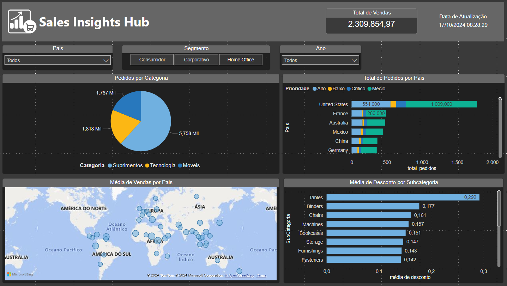
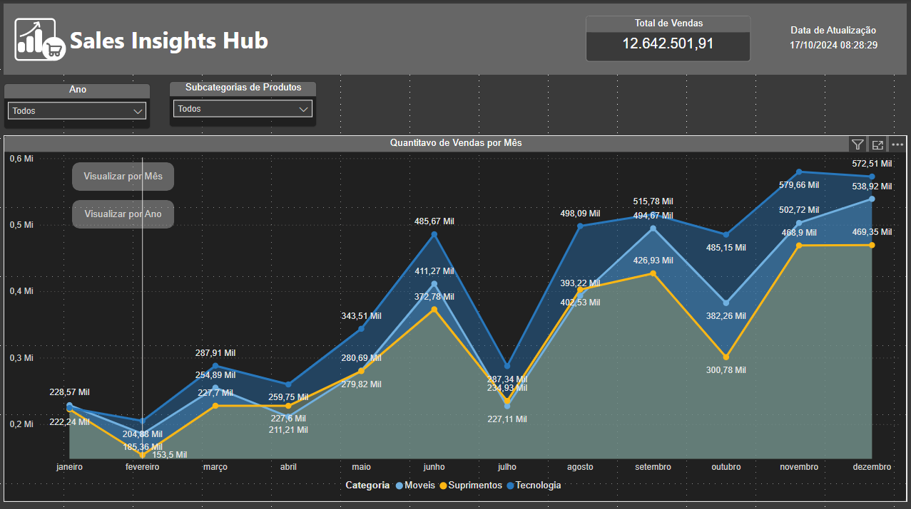
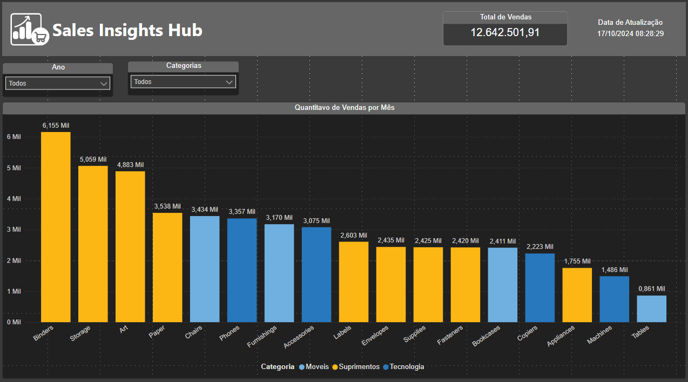

# Dashboard Analítico de Vendas - Power BI

Este repositório contém um dashboard analítico de vendas desenvolvido em Power BI durando o curso da <a href="https://www.datascienceacademy.com.br/start">Data Science Academy</a>.
O dashboard é focado em fornecer insights detalhados sobre as métricas de desempenho de vendas, tendências de mercado, comportamento de clientes e análise de produtos. O objetivo
é auxiliar a tomada de decisões estratégicas para otimizar as operações comerciais e aumentar a rentabilidade da empresa.

# 📊 Sobre o Projeto

O Dashboard Analítico de Vendas foi criado com o intuito de:

- Informar o valor total de vendas.
- Verificar quantas vendas foram realizadas por categoria de produto.
- Analisar as vendas realizadas por país considerando a prioridade de entrega.
- Informar a média de descontos nas vendas por subcategoria de produto.
- Apresentar os paises com maior média no valor de vendas.

# 🛠️ Tecnologias Utilizadas

- Power BI - Utilizado para a criação do dashboard e visualização dos dados.
- DAX - Linguagem para criação de cálculos personalizados e medidas no Power BI.
- Excel/CSV - Fonte de dados para simulação dos dados de vendas.

# 📈 Principais Métricas e KPIs

O Dashboard inclui as seguintes métricas e KPIs:

- Vendas totais.
- Volumes de Vendas.
- Médias de Descontos.
- Análise Geográfica.
- Desempenho de Países.

# 📂 Estrutura do Repositório

```
|-- Data/
|  |-- vendas.csv
|-- Dashboard/
|  |-- dashboard-analise-vendas.pbix
|-- README.MD
```

# 📷 Pré-visualização

Visão Geral:


Evolução de Vendas por Mês:


Evolução de Vendas por Ano:


# 🚀 Como Usar

1. Clone o repositório:

```
git clone ...
```

2. Acesse a pasta do projeto:

```
cd dashboard-analítico-vendas
```

3. Abra o arquivo .pbix no Power BI Desktop:

- Baixe o Power BI Desktop <a href="https://www.microsoft.com/pt-br/download/details.aspx?id=58494">aqui</a>
- Abra o arquivo dashboard-analítico-vendas para visualizar e explorar o dashboard.

# 📋 Requisitos

- Power BI Desktop instalado.
- Conexão com as fontes de dados (ou ajuste para usar os arquivos CSV incluídos).

# 🤝 Contribuições

Contribuições são sempre bem-vindas! Se você tiver sugestão de melhorias ou quiser reportar algum problema, sinta-se à vontade para abrir uma **issue** ou enviar um **pull request**.

# 👤 Autor

- **DIOGO DIAS MELLO** - Desenvolvedor Backend e Entusiasta de Análise de Dados.

# 📝 Notas Finais

Este dashboard foi desenvolvido para fins de aprendizado e demonstração. Sinta-se à vontado para utilizá-lo como referência em seus próprios projetos de análise de dados e visualização.
