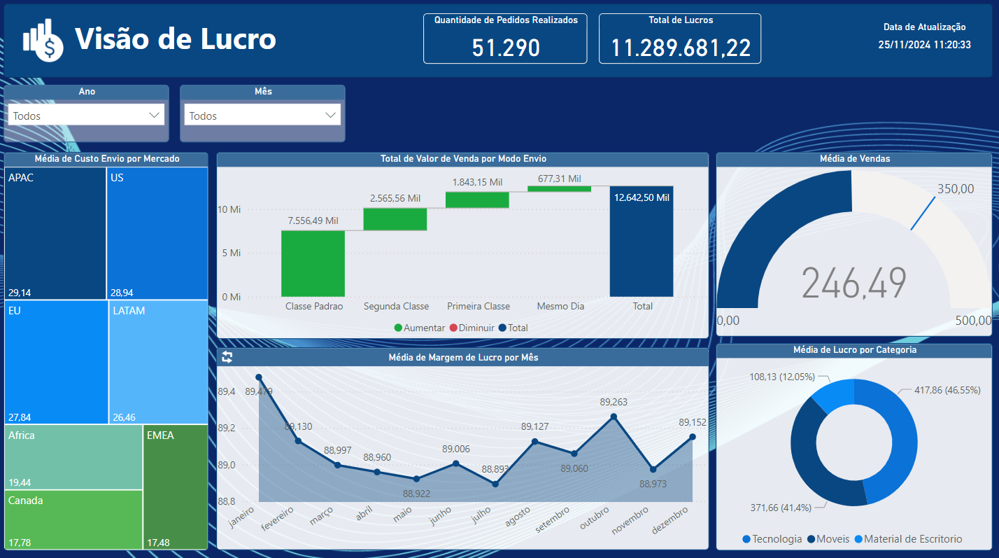
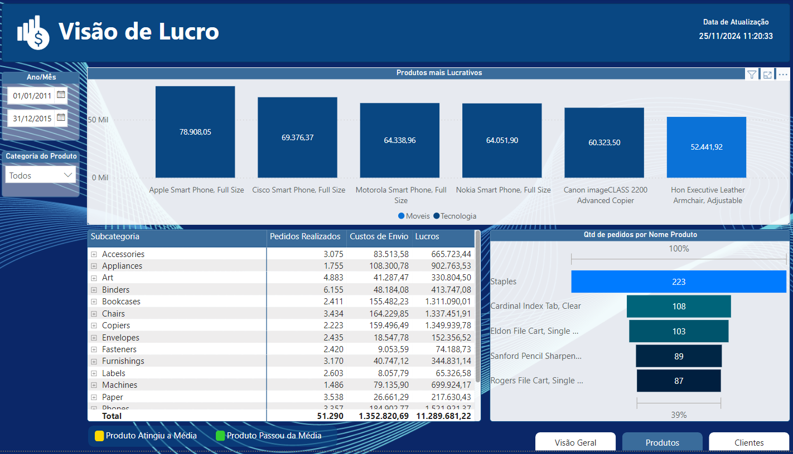

# Dashboard de Análises de Vendas, Custos, Margem de Lucros e KPIs - Power BI

Este repositório contém um dashboard analítico desenvolvido em Power BI com o objetivo de apresentar as principais análises de vendas, custos, margens de lucro e KPIs relevantes para a tomada de decisões estratégicas em negócios. O projeto busca fornecer uma visão abrangente do desempenho financeiro e operacional, permitindo uma análise detalhada de diferentes aspectos comerciais.

---

# 📊 Sobre o Projeto

O Dashboard de Análises de Vendas, Custos, Margem de Lucros e KPIs foi criado com o intuito de:

- Fornecer uma visão clara do total de vendas e sua distribuição por período e produto.
- Analisar detalhadamente os custos operacionais e como eles impactam a rentabilidade.
- Calcular e visualizar a margem de lucro por produto, categoria ou período.
- Apresentar KPIs importantes para monitorar o desempenho geral e específico das operações.
- Auxiliar na identificação de tendências de mercado e oportunidades de melhoria.

---

# 🛠️ Tecnologias Utilizadas

- Power BI - Utilizado para a criação do dashboard e visualização dos dados.
- DAX - Linguagem para criação de cálculos personalizados e medidas no Power BI.
- Excel/CSV - Fonte de dados contendo as informações de vendas, custos e KPIs.

---

# 📈 Principais Métricas e KPIs

O Dashboard inclui as seguintes métricas e KPIs:

- Total de vendas e volume por produto/categoria.
- Custos totais e detalhados por operação.
- Margem de lucro bruta e líquida.
- Análise de tendência de vendas e custos ao longo do tempo.
- KPIs de desempenho como ticket médio, crescimento de vendas, e retorno sobre investimento (ROI).

---

# 📂 Estrutura do Repositório

```bash
|-- Data/
| |-- clientes.csv
| |-- pedidos.csv
| |-- produtos.csv
| |-- vendas.csv
|-- Dashboard/
| |-- dashboard-analise-vendas-custos.pbix
|-- Dashboard/
| |-- public/
|-- README.MD
```

---

# 📷 Pré-visualização

Visão Geral do Painel:


Visão de Produtos:


---

# 🚀 Como Usar

1. Clone o repositório:

```bash
git clone
```

2. Acesse a pasta do projeto:

```bash
cd dashboard-analise-vendas-custos
```

3. Abra o arquivo .pbix no Power BI Desktop:

- Baixe o Power BI Desktop <a href="https://www.microsoft.com/pt-br/download/details.aspx?id=58494">aqui</a>
- Abra o arquivo dashboard-analise-vendas-custos para visualizar e explorar o dashboard.

---

# 📋 Requisitos

- Power BI Desktop instalado.
- Conexão com as fontes de dados (ou ajuste para usar os arquivos CSV incluídos).

---

# 🤝 Contribuições

Contribuições são sempre bem-vindas! Se você tiver sugestões de melhorias ou quiser reportar algum problema, sinta-se à vontade para abrir uma **issue** ou enviar um **pull request**.

---

# 👤 Autor

- **DIOGO DIAS MELLO** - Desenvolvedor Backend e Entusiasta de Análise de Dados.

---

# 📝 Notas Finais

Este dashboard foi desenvolvido para fins de aprendizado e demonstração. Sinta-se à vontade para utilizá-lo como referência em seus próprios projetos de análise de dados e visualização.
