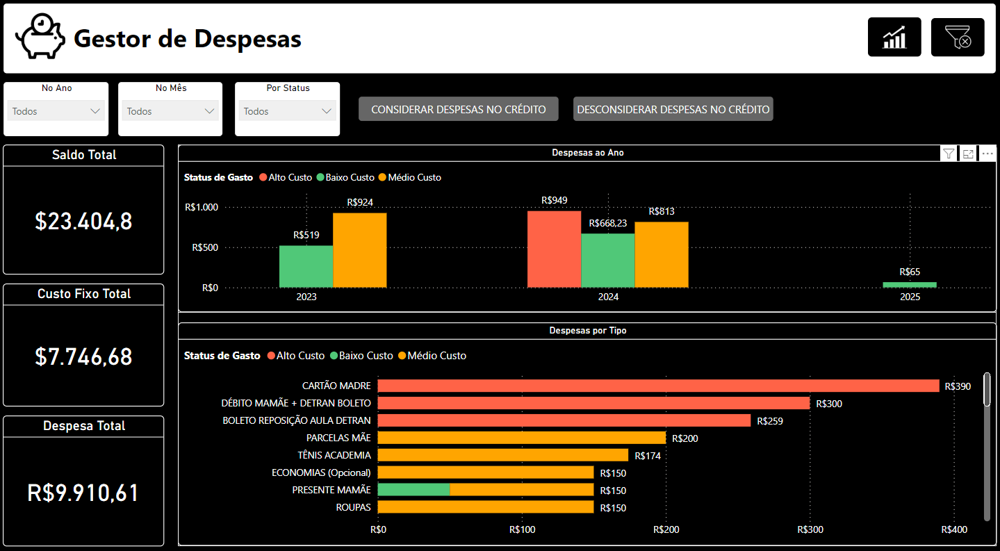
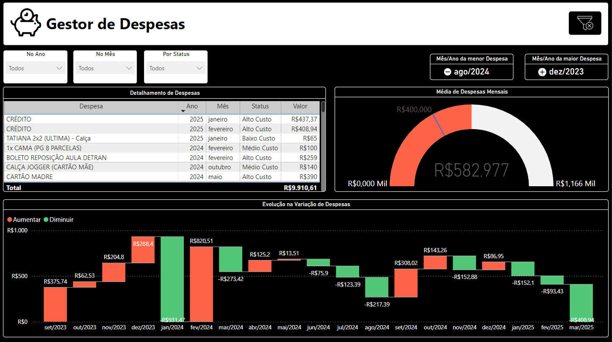
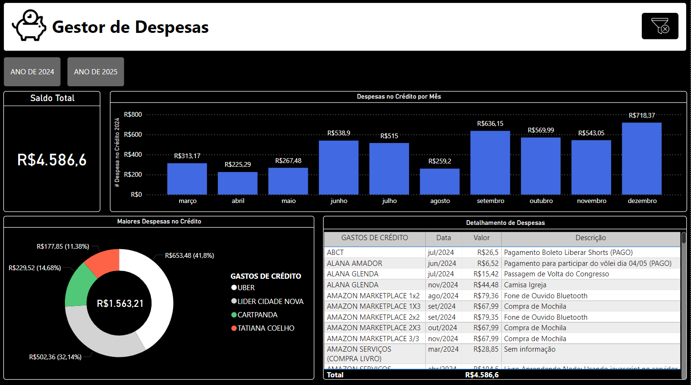

# Gerenciador de Despesas - Power BI

Este repositório contém um projeto de Gerenciador de Despesas desenvolvido em Power BI, com o objetivo de proporcionar uma visão clara e detalhada sobre os gastos do dia a dia. O projeto foi criado utilizando DAX e Excel como base de dados, oferecendo insights valiosos para um melhor controle financeiro pessoal.

---

# 📊 Sobre o Projeto

O Gerenciador de Despesas foi criado com o intuito de:

- Monitorar o total de despesas em diferentes períodos.
- Identificar as categorias de maior impacto financeiro.
- Analisar os gastos recorrentes e pontuais ao longo do tempo.
- Visualizar a distribuição de despesas por categoria e subcategoria.
- Proporcionar uma visão geral sobre o orçamento mensal.

---

# 🛠️ Tecnologias Utilizadas

- **Power BI** - Para criação do dashboard e visualização dos dados.
- **DAX** - Para cálculos personalizados e medidas avançadas no Power BI.
- **Excel** - Fonte de dados para registro e simulação das despesas.

---

# 📈 Principais Métricas e KPIs

O Dashboard inclui as seguintes métricas e KPIs:

- Total de despesas.
- Média de gastos por categoria.
- Evolução dos gastos por mês.
- Percentual de cada categoria no orçamento total.
- Comparação entre despesas planejadas e realizadas.

---

# 📂 Estrutura do Repositório

```bash
|-- Data/
| |-- despesas_finais.xlsx
| |-- gastos_credito_2024.xlsx
| |-- gastos_credito_2025.xlsx
| |-- gastos_fixos.xlsx
|-- Dashboard/
| |-- dax/
| | |-- d_calendar.dax
| |-- dashboard_gestor_despesas.pbix
|-- README.MD
```

---

# 📷 Pré-visualização

**Visão Geral sobre as Despesas**:



**Visão da Evolução das Despesas**:



**Visão detalhada sobre as Despesas feitas no Crédito**:



---

# 🚀 Como Usar

1. Clone o repositório:

```bash
git clone ...
```

2. Acesse a pasta do projeto:

```bash
cd gerenciador_despesas
```

3. Abra o arquivo .pbix no Power BI Desktop:
   - Baixe o Power BI Desktop <a href="https://www.microsoft.com/pt-br/download/details.aspx?id=58494">aqui</a>
   - Abra o arquivo dashboard-analise-vendas-custos para visualizar e explorar o dashboard.

---

# 📋 Requisitos

- Power BI Desktop instalado.
- Conexão com as fontes de dados (ou ajuste para usar os arquivos CSV incluídos).

---

# 🤝 Contribuições

Contribuições são sempre bem-vindas! Se você tiver sugestões de melhorias ou quiser reportar algum problema, sinta-se à vontade para abrir uma **issue** ou enviar um **pull request**.

---

# 👤 Autor

- **DIOGO DIAS MELLO** - Desenvolvedor Backend e Entusiasta de Análise de Dados.

---

# 📝 Notas Finais

Este Gerenciador de Despesas foi desenvolvido para fins de aprendizado e demonstração. Fique à vontade para utilizá-lo como base para seus próprios projetos de controle financeiro e análise de dados.
